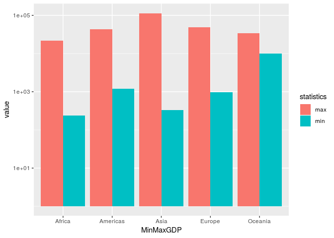
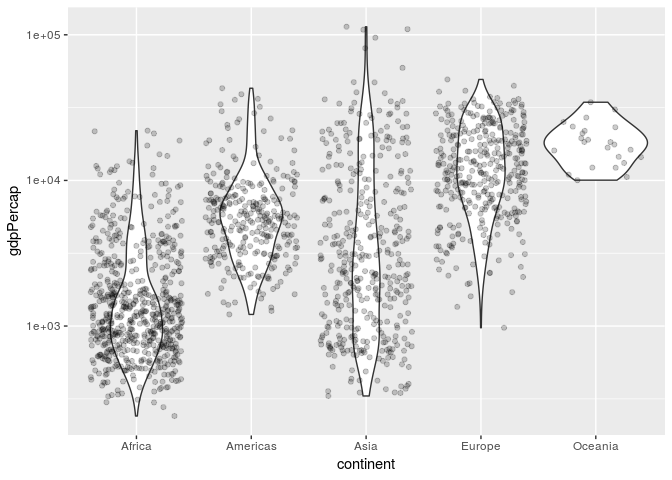
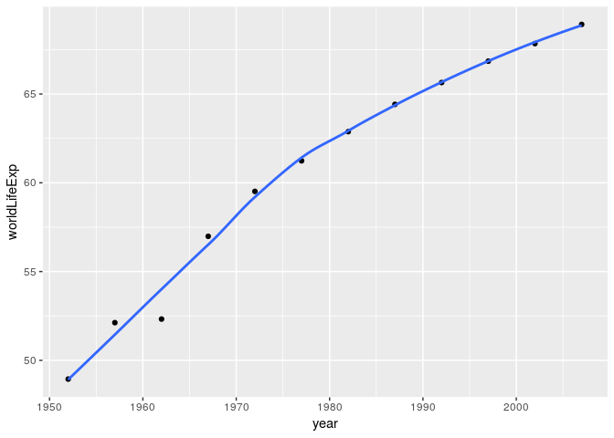
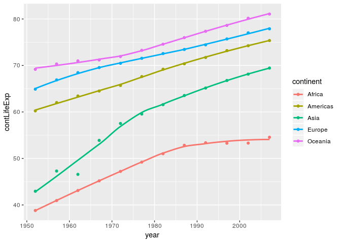

Assignment 3 Gapminder Exploration
================

Load gapminder and tidyverse
----------------------------

``` r
suppressPackageStartupMessages(library(tidyverse))
```

    ## Warning: replacing previous import by 'tibble::as_tibble' when loading
    ## 'broom'

    ## Warning: replacing previous import by 'tibble::tibble' when loading 'broom'

``` r
suppressPackageStartupMessages(library(gapminder))
```

Task Menu
---------

### Get the maximum and minimum of GDP per capita for all continents

``` r
MaxMinGDP = gapminder %>% 
  group_by(continent) %>% 
  summarize(min = min(gdpPercap), max = max(gdpPercap)) 
```

``` r
# create a dataset
MinMaxGDP=rep(MaxMinGDP$continent, each=2)
statistics=c('max', 'min')
value = c(rbind(MaxMinGDP$max,MaxMinGDP$min))
data=data.frame(MaxMinGDP,statistics,value)
 
# Grouped
ggplot(data, aes(fill=statistics, y=value, x=MinMaxGDP)) + 
  geom_bar(position="dodge", stat="identity") + 
  scale_y_log10()
```



### Look at the spread of GDP per capita within the continents.

``` r
ggplot(gapminder, aes(continent, gdpPercap)) + 
  geom_violin() + 
  geom_jitter(alpha=0.2) + 
  scale_y_log10()
```



### Compute a trimmed mean of life expectancy for different years. Or a weighted mean, weighting by population. Just try something other than the plain vanilla mean.

``` r
pop_data = gapminder %>% 
  mutate(wt_mean = pop*lifeExp) %>% 
  group_by(year) %>% 
  summarize(totalYears = sum(wt_mean), totalPop = sum(as.double(pop))) %>% 
  mutate(worldLifeExp = totalYears/totalPop) 
```

``` r
pop_data %>% 
  ggplot(aes(x=year, y=worldLifeExp)) + 
  geom_point() + 
  geom_smooth(method="loess", se = FALSE, show.legend = FALSE)
```



Local regression model for world life expectancy

### How is life expectancy changing over time on different continents?

``` r
cont_lifeExp = gapminder %>% 
  mutate(wt_mean = pop*lifeExp) %>% 
  group_by(year, continent) %>% 
  summarize(totalYears = sum(wt_mean), totalPop = sum(as.double(pop))) %>% 
  mutate(contLifeExp = totalYears/totalPop) %>% 
  arrange(continent, year)
cont_lifeExp 
```

    ## # A tibble: 60 x 5
    ## # Groups:   year [12]
    ##     year continent   totalYears  totalPop contLifeExp
    ##    <int> <fct>            <dbl>     <dbl>       <dbl>
    ##  1  1952 Africa     9220386795. 237640501        38.8
    ##  2  1957 Africa    10842537827. 264837738        40.9
    ##  3  1962 Africa    12779653318. 296516865        43.1
    ##  4  1967 Africa    15147442886. 335289489        45.2
    ##  5  1972 Africa    17934984442. 379879541        47.2
    ##  6  1977 Africa    21310425240. 433061021        49.2
    ##  7  1982 Africa    25475484368. 499348587        51.0
    ##  8  1987 Africa    30365491264. 574834110        52.8
    ##  9  1992 Africa    35177103943. 659081517        53.4
    ## 10  1997 Africa    39633851359. 743832984        53.3
    ## # ... with 50 more rows

``` r
cont_lifeExp %>% 
  ggplot(aes(x=year, y=contLifeExp, color=continent)) + 
  geom_point() + 
  geom_smooth(method='loess', se = FALSE)
```



### Report the absolute and/or relative abundance of countries with low life expectancy over time by continent: Compute some measure of worldwide life expectancy – you decide – a mean or median or some other quantile or perhaps your current age. Then determine how many countries on each continent have a life expectancy less than this benchmark, for each year.
