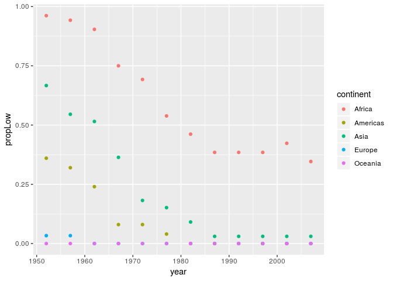

Assignment 3 Gapminder Exploration
================

Load gapminder and tidyverse
----------------------------

``` r
suppressPackageStartupMessages(library(tidyverse))
```

    ## Warning: replacing previous import by 'tibble::as_tibble' when loading
    ## 'broom'

    ## Warning: replacing previous import by 'tibble::tibble' when loading 'broom'

``` r
suppressPackageStartupMessages(library(gapminder))
```

Task Menu
---------

### Get the maximum and minimum of GDP per capita for all continents

``` r
MaxMinGDP = gapminder %>% 
  group_by(continent) %>% 
  summarize(min = min(gdpPercap), max = max(gdpPercap)) 
```

``` r
# create a dataset
MinMaxGDP=rep(MaxMinGDP$continent, each=2)
statistics=c('max', 'min')
value = c(rbind(MaxMinGDP$max,MaxMinGDP$min))
data=data.frame(MaxMinGDP,statistics,value)
 
# Grouped
ggplot(data, aes(fill=statistics, y=value, x=MinMaxGDP)) + 
  geom_bar(position="dodge", stat="identity") + 
  scale_y_log10()
```


### Look at the spread of GDP per capita within the continents.

``` r
ggplot(gapminder, aes(continent, gdpPercap)) + 
  geom_violin() + 
  geom_jitter(alpha=0.2) + 
  scale_y_log10()
```


### Compute a trimmed mean of life expectancy for different years. Or a weighted mean, weighting by population. Just try something other than the plain vanilla mean.

``` r
pop_data = gapminder %>% 
  mutate(wt_mean = pop*lifeExp) %>% 
  group_by(year) %>% 
  summarize(totalYears = sum(wt_mean), totalPop = sum(as.double(pop))) %>% 
  mutate(worldLifeExp = totalYears/totalPop) 
```

``` r
pop_data %>% 
  ggplot(aes(x=year, y=worldLifeExp)) + 
  geom_point() + 
  geom_smooth(method="loess", se = FALSE, show.legend = FALSE)
```


Local regression model for world life expectancy

### How is life expectancy changing over time on different continents?

``` r
cont_lifeExp = gapminder %>% 
  mutate(wt_mean = pop*lifeExp) %>% 
  group_by(year, continent) %>% 
  summarize(totalYears = sum(wt_mean), totalPop = sum(as.double(pop))) %>% 
  mutate(contLifeExp = totalYears/totalPop) %>% 
  arrange(continent, year)
```

``` r
cont_lifeExp %>% 
  ggplot(aes(x=year, y=contLifeExp, color=continent)) + 
  geom_point() + 
  geom_smooth(method='loess', se = FALSE)
```


### Report the absolute and/or relative abundance of countries with low life expectancy over time by continent: Compute some measure of worldwide life expectancy – you decide – a mean or median or some other quantile or perhaps your current age. Then determine how many countries on each continent have a life expectancy less than this benchmark, for each year.

I decided to use 50 as the cutoff of low life expectancy.

``` r
data_lowLifeExp = gapminder %>% 
  mutate(low_age = if_else(lifeExp < 50, 1, 0)) %>% 
  group_by(year, continent) %>% 
  summarize(propLow = sum(low_age)/n_distinct(country))
```

``` r
data_lowLifeExp %>% 
  ggplot(aes(year, propLow, color=continent)) + 
  geom_point()
```



Find countries with interesting stories. Open-ended and, therefore, hard. Promising but unsuccessful attempts are encouraged. This will generate interesting questions to follow up on in class.

Here, we are finding the countries with an overall population drop. This is a rare situation and it will be interesting to investigate further into these specific causes.

``` r
pop_drop = gapminder %>% 
  group_by(country) %>% 
  mutate(popdiff = pop - lag(pop)) %>% 
  filter(popdiff < 0)
knitr::kable(pop_drop)
```

| country                | continent |  year|  lifeExp|       pop|   gdpPercap|   popdiff|
|:-----------------------|:----------|-----:|--------:|---------:|-----------:|---------:|
| Afghanistan            | Asia      |  1982|   39.854|  12881816|    978.0114|  -1998556|
| Bosnia and Herzegovina | Europe    |  1992|   72.178|   4256013|   2546.7814|    -82964|
| Bosnia and Herzegovina | Europe    |  1997|   73.244|   3607000|   4766.3559|   -649013|
| Bulgaria               | Europe    |  1992|   71.190|   8658506|   6302.6234|   -313452|
| Bulgaria               | Europe    |  1997|   70.320|   8066057|   5970.3888|   -592449|
| Bulgaria               | Europe    |  2002|   72.140|   7661799|   7696.7777|   -404258|
| Bulgaria               | Europe    |  2007|   73.005|   7322858|  10680.7928|   -338941|
| Cambodia               | Asia      |  1977|   31.220|   6978607|    524.9722|   -471999|
| Croatia                | Europe    |  1997|   73.680|   4444595|   9875.6045|    -49418|
| Czech Republic         | Europe    |  1997|   74.010|  10300707|  16048.5142|    -14995|
| Czech Republic         | Europe    |  2002|   75.510|  10256295|  17596.2102|    -44412|
| Czech Republic         | Europe    |  2007|   76.486|  10228744|  22833.3085|    -27551|
| Equatorial Guinea      | Africa    |  1977|   42.024|    192675|    958.5668|    -84928|
| Germany                | Europe    |  1977|   72.500|  78160773|  20512.9212|   -556315|
| Germany                | Europe    |  1987|   74.847|  77718298|  24639.1857|   -616968|
| Guinea-Bissau          | Africa    |  1967|   35.492|    601287|    715.5806|    -26533|
| Hungary                | Europe    |  1987|   69.580|  10612740|  12986.4800|    -92795|
| Hungary                | Europe    |  1992|   69.170|  10348684|  10535.6285|   -264056|
| Hungary                | Europe    |  1997|   71.040|  10244684|  11712.7768|   -104000|
| Hungary                | Europe    |  2002|   72.590|  10083313|  14843.9356|   -161371|
| Hungary                | Europe    |  2007|   73.338|   9956108|  18008.9444|   -127205|
| Ireland                | Europe    |  1957|   68.900|   2878220|   5599.0779|    -73936|
| Ireland                | Europe    |  1962|   70.290|   2830000|   6631.5973|    -48220|
| Kuwait                 | Asia      |  1992|   75.190|   1418095|  34932.9196|   -473392|
| Lebanon                | Asia      |  1982|   66.983|   3086876|   7640.5195|    -28911|
| Lesotho                | Africa    |  2007|   42.592|   2012649|   1569.3314|    -34123|
| Liberia                | Africa    |  1992|   40.802|   1912974|    636.6229|   -356440|
| Montenegro             | Europe    |  2007|   74.543|    684736|   9253.8961|    -35494|
| Poland                 | Europe    |  2002|   74.670|  38625976|  12002.2391|    -28981|
| Poland                 | Europe    |  2007|   75.563|  38518241|  15389.9247|   -107735|
| Portugal               | Europe    |  1972|   69.260|   8970450|   9022.2474|   -132550|
| Romania                | Europe    |  1997|   69.720|  22562458|   7346.5476|   -234569|
| Romania                | Europe    |  2002|   71.322|  22404337|   7885.3601|   -158121|
| Romania                | Europe    |  2007|   72.476|  22276056|  10808.4756|   -128281|
| Rwanda                 | Africa    |  1997|   36.087|   7212583|    589.9445|    -77620|
| Serbia                 | Europe    |  2002|   73.213|  10111559|   7236.0753|   -225035|
| Slovenia               | Europe    |  2002|   76.660|   2011497|  20660.0194|      -115|
| Slovenia               | Europe    |  2007|   77.926|   2009245|  25768.2576|     -2252|
| Somalia                | Africa    |  1992|   39.658|   6099799|    926.9603|   -822059|
| South Africa           | Africa    |  2007|   49.339|  43997828|   9269.6578|   -435794|
| Switzerland            | Europe    |  1977|   75.390|   6316424|  26982.2905|    -84976|
| Trinidad and Tobago    | Americas  |  1992|   69.862|   1183669|   7370.9909|     -7667|
| Trinidad and Tobago    | Americas  |  1997|   69.465|   1138101|   8792.5731|    -45568|
| Trinidad and Tobago    | Americas  |  2002|   68.976|   1101832|  11460.6002|    -36269|
| Trinidad and Tobago    | Americas  |  2007|   69.819|   1056608|  18008.5092|    -45224|
| West Bank and Gaza     | Asia      |  1972|   56.532|   1089572|   3133.4093|    -53064|
